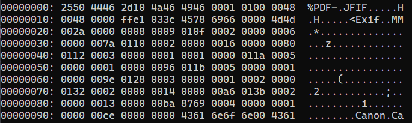
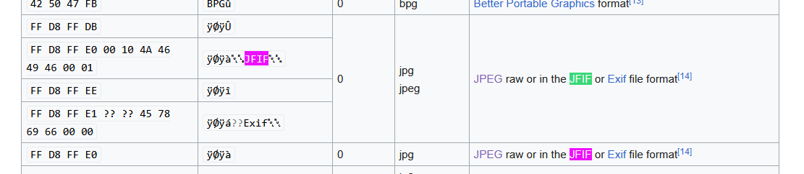
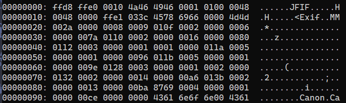

# Solution
The file has a jpg extension, but upon executing `file` command on it, the result is a PDF document.
```
> file liar.jpg
liar.jpg: PDF document, version \020.F
```
We can check the file header for anomalies.


We can see that the Header is that of a PDF file. Yet, there is still the JFIF part of a regular jpeg image.


We can edit the content of the header to change it to a regular format.


We can now open the image correctly:
