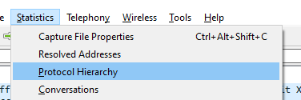
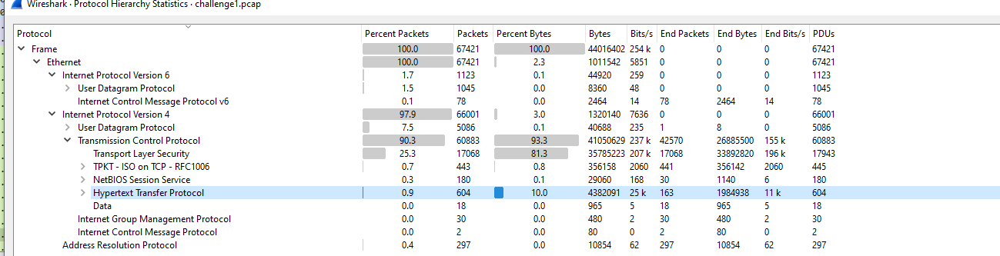
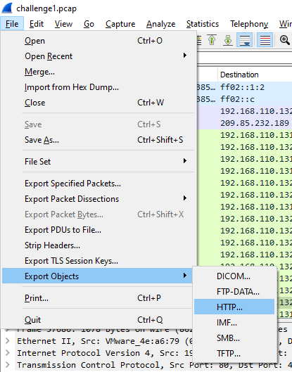
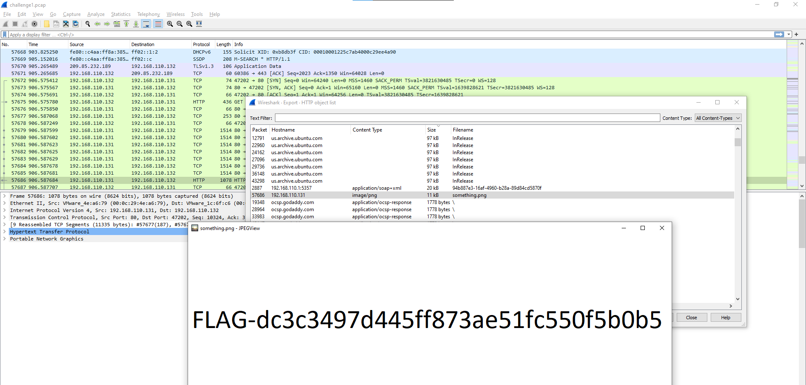
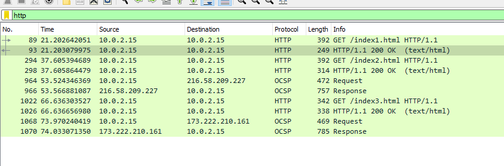
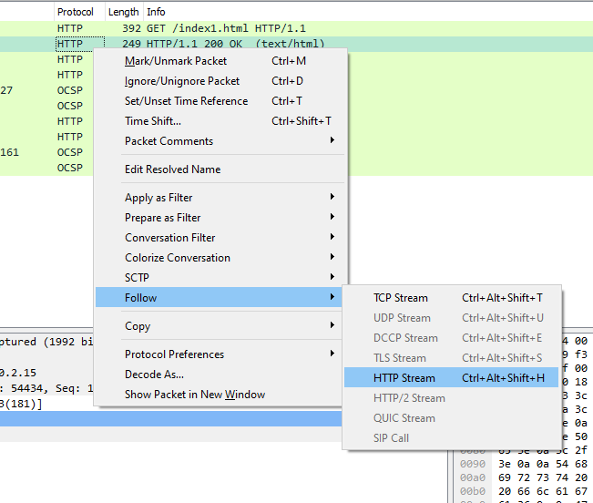
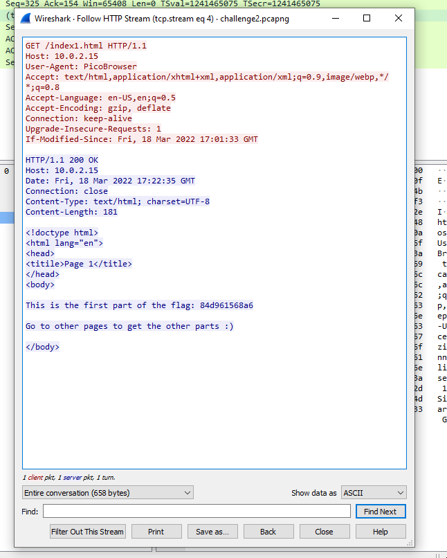

# Challenge 1

Upon opening the capture in Wireshark, the first thing we can do is look at the protocols used in transfers. We can do this through Statistics -> Protocol Hierarchy window.

Here we can see different protocols used used in the capture. However, one protocol in particular catches the eye. It is HTTP.

Due to it being in plaintext, we can easily extract information out of it. We can do this through File -> Export Objects -> HTTP window

Looking through the capture we find an image, we can click on preview to look at it.

# Challenge 2

As with the first challenge, we find that it HTTP is used somewhere in the capture. We can filter our results to only show HTTP packets.

We can see a bunch of HTTP requests and responses. These requests seem interesting, so we will look at their content by following the HTTP stream. Right-click on a packet -> Follow -> HTTP Stream

We can do this for the three parts of the hash.
84d961568a65073a3bcf0eb216b2a576

We can use an online hash cracker to finally crack it.